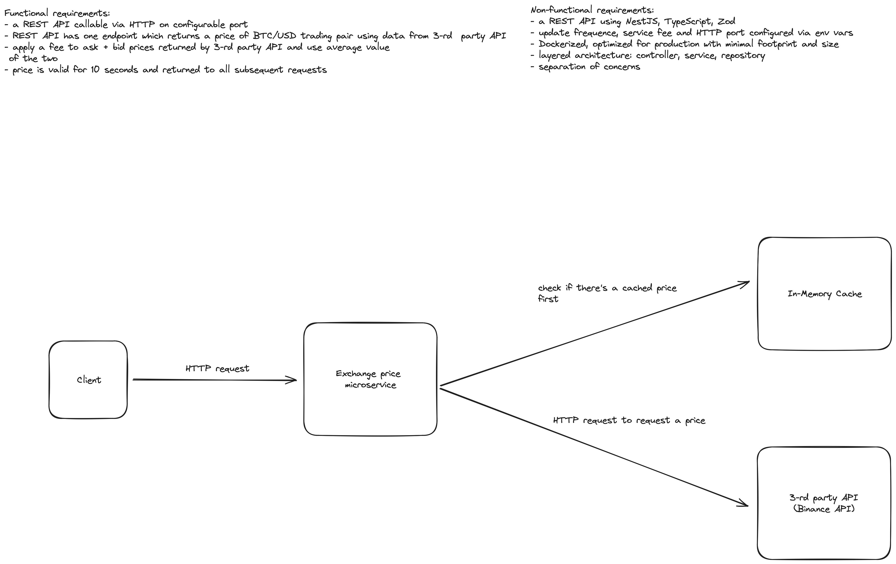

## Description

Simple Crypto API

## Overview



NestJS REST API

- REST API built using NestJS, NodeJS 18, TypeScript, Zod
- Type-safe access to `process.env` using Zod
- Production-ready Docker image with multi-stage builds
- In-Memory configurable TTL cache
- spin up in docker container using `make`

## Prerequisites

Node 18, make to run `Makefile`, Docker 20.10.17

## Installation

```bash
$ pnpm install
```

## Running the app

```bash
# development
$ pnpm run start

# watch mode
$ pnpm run start:dev

# production mode
$ pnpm run start:prod

# docker locally
$ make up

# shut down application in docker locally
$ make down
```
